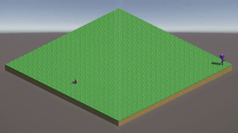
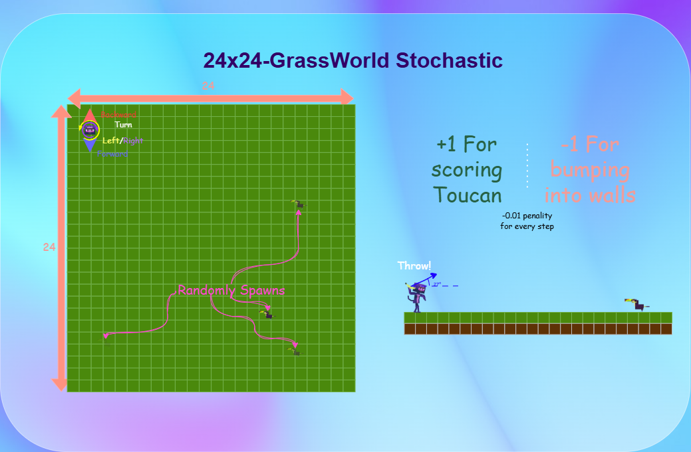

# ToucanHush

ToucanHush is a **custom Unity ML-Agents environment** built for reinforcement learning experimentation.
It introduces an environment where an agent learns to **navigate, avoid walls, and score points by throwing bananas at a stationed toucan**.



This repository hosts:

*  **Unity environments**: *12x12-GrassWorld Deterministic*, *24x24GrassWorld-Stochastic*, etc.
* ️ **Training configuration** (ML-Agents YAML)

---

##  Getting Started

### Clone the repo

```bash
git clone https://github.com/partzel/ToucanHush.git
cd ToucanHush
```

### Running the environment

1. Install [Unity ML-Agents](https://github.com/Unity-Technologies/ml-agents).
2. Open the Unity project in `ToucanHush/simulation/ToucanHushSimulation`.
3. Run training or inference with:

   ```bash
   mlagents-learn config/ppo_grassworld.yaml --run-id=ppo-grassworld
   ```


You can also run it from a published release using the `--env` argument

---

## Environment Rules

* **Actions:** Forward, Backward, Turn Left, Turn Right, Throw Banana
* **Rewards:**

  * +1 for scoring a toucan
  * -1 for bumping into walls
  * -0.01 per step

* **Special mechanic:** Throw action at 27°

**12x12GrassWorld-Deterministic**

**24x24GrassWorld-Stochastic**


---

## Roadmap

* Stochastic variants of GrassWorld
* Curriculum learning setup
* Multi-agent extensions (Monkeys vs Toucans or Monkey vs Monkey)
* Experiment logging & reports

---

## Pretrained Models
A collection of pretrained models for this environment can be found on [HuggingFace](https://huggingface.co/collections/partzel/toucanhush-rl-models-68ba1e11cd84bda9b50a3833)

## Note about assets
All assets have been custom made for this environment and you can get them for free from [here](https://partzel.itch.io/hushtoucanassetpack)

---

Check the [Releases](https://github.com/partzel/ToucanHush/releases).

---